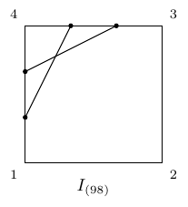
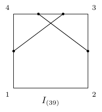
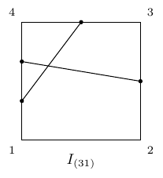
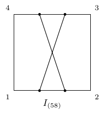
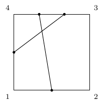
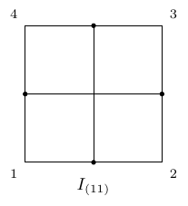
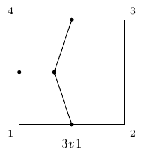
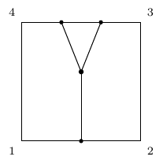
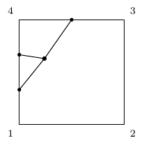
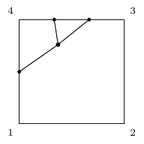

# 10 Two-Loop Pure-Gluon Wilson Line Integrals — J only

Shared 2026-06-27 with collaborators for verification and CAS evaluation.

## Notation (see CJ_summary.md for full derivation)

- $D=4-2\varepsilon$, $v_i$ lightlike ($v_i^2=0$), $v_{ij}\equiv v_i\!\cdot\!v_j$
- Kinematics: $v_{14}=1$, $z=v_{12}=v_{34}$, $v_{13}=v_{24}=-(1+z)$, $v_{23}=1$
- $+i0$ Minkowski causal prescription
- $I = C \times C_1 \times J(\varepsilon, z)$ — this file contains $J$ only
- $x_i\in[0,1]$ hypercube
- TGV: $\alpha_1,\alpha_2,\alpha_3\ge0$, $\alpha_1+\alpha_2+\alpha_3=1$

## Classification

| # | ID | Diagram | Gluons | Edges | $x$-dim | $\alpha$-dim | Type |
|---|-----|---------|--------|-------|---------|--------------|------|
| 1 | 2g1 |  | 2 | 3,3–4,4 | 4 | — | double on adjacent pair |
| 2 | 2g2 |  | 2 | 2,3–3,4 | 4 | — | adjacent chain |
| 3 | 2g3 |  | 2 | 2,3–4,4 | 4 | — | mixed |
| 4 | 2g4 |  | 2 | 1,1–3,3 | 4 | — | double opposite |
| 5 | 2g5 |  | 2 | 1,3–3,4 | 4 | — | mixed |
| 6 | 2g6 |  | 2 | 1,2–3,4 | 4 | — | one per edge |
| 7 | 3v1 |  | 3 | 1,3,4 | 3 | 3 | TGV non-degenerate |
| 8 | 3v2 |  | 3 | 1,3,3 | 3 | 3 | TGV Δ₂₃=0 |
| 9 | 3v3 |  | 3 | 3,4,4 | 3 | 3 | TGV Δ₂₃=0 |
| 10 | 3v4 |  | 3 | 3,3,4 | 3 | 3 | TGV Δ₁₂=0 |

## File Inventory

| File | Purpose |
|------|---------|
| `README.md` | This file — conventions and quick reference |
| `cj_pure_J.json` | Machine-readable: every J as LaTeX + plain-text + metadata |
| `cj_pure_J.py` | Python module: `import cj_pure_J` → dict/list access |

## Quick Start

### Python
```python
from cj_pure_J import INTEGRALS
print(INTEGRALS["2g2"]["J_plain"])
# → x2*z * (-x2*(1 - x1) + i0)**(-1 + eps) * (-x3*(1 - x2*x4)*z + i0)**(-1 + eps)
```

### Mathematica
```mathematica
data = Import["cj_pure_J.json", "RawJSON"];
data[["2g2", "J_plain"]]
```

### Maple
```maple
# parse cj_pure_J.json with JSON:-Parse
```